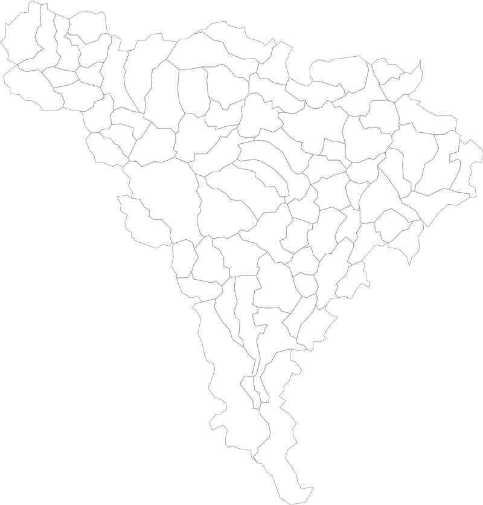
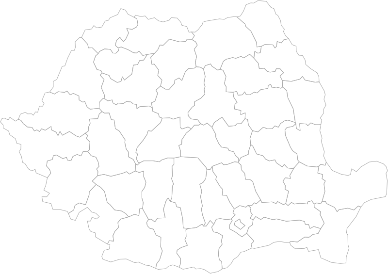
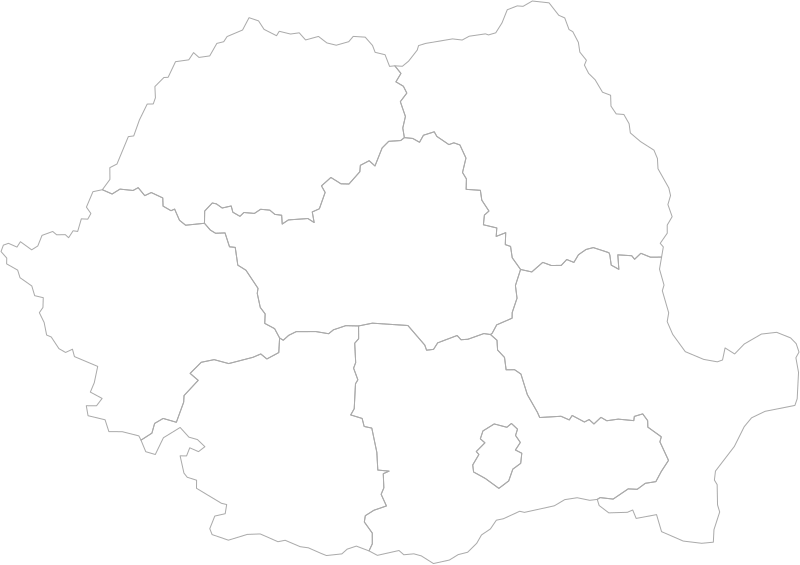

# Limite Unități Administrativ-Teritoriale România

## Date geografice

De la @geospatialorg

~~[geo-spatial.org - România - seturi de date vectoriale generale > Limitele unităților administrative din România](http://www.geo-spatial.org/download/romania-seturi-vectoriale#uat "dead link")~~

Fișier sursă ~~[**GeoJSON poligon 20.12.2019**](http://www.geo-spatial.org/file_download/29535 "dead link")~~  
Size: 189 MB (198,546,274 bytes)  
MD5 checksum: A04BAA4CDF93E93A169EF77EAE31469C  

## Unelte

[mapshaper](https://mapshaper.org/)

`npm install -g mapshaper`

[Command Reference · mbloch/mapshaper Wiki](https://github.com/mbloch/mapshaper/wiki/Command-Reference)

`npm install -g svgo`

[svg/svgo: Node.js tool for optimizing SVG files](https://github.com/svg/svgo)

## Procesare

### Împărțire pe județe

```sh
cd src
# Unzip
gunzip --keep ro_uat_poligon.geojson.gz
# Split by counties
mapshaper ro_uat_poligon.geojson -simplify 0.009 -split countyMn -o ../uat/ format=geojson extension=geojson prettify
```

✓ Simplificare `9%` folosind algoritmul implicit `weighted Visalingam simplification`

## Unități administrativ-teritoriale

  
[_drag-uat-geojson-to-svg.cmd](uat/_drag-uat-geojson-to-svg.cmd)

```xml
<g id="AB" fill="none" stroke="#aaa">
  <!-- ... -->
  <path d="M519.349..." id="7767" data-name="Stremț" data-type="comuna"/>
  <!-- ... -->
```

Pentru selecție mai rapidă înlocuim în toate SVG-urile după export `data-type` → `class`

```xml
<path d="M519.349..." id="7767" data-name="Stremț" class="comuna"/>
```

✓ Proiecție: `EPSG:3844` - Pulkovo 1942(58) / Stereo70 - Projected  
✓ Fiecare UAT e un `<path>`;  
✓ Un singur grup `<g>` top-level  
✓ Fără lufturi / margini  
✓ SIRUTA: `id="7767"` natcode = Codul SIRUTA al unitații administrative  
✓ Nume localitate: `data-name="Stremț"`  
✓ Tip localitatate: `class="comuna"`  
✓ Responsiv: SVGO `removeDimensions`  

```js
// natLevName mappings
type = {
  'Oras': 'oras',
  'Comuna': 'comuna',
  'Municipiu, altul decat resedinta de judet': 'municipiu',
  'Municipiu resedinta de judet': 'municipiu resedinta',
  'Sectoarele municipiului Bucuresti': 'sector'
}[natLevName]
```

## Județe

  
[_drag-judete-geojson-to-svg.cmd](judete/_drag-judete-geojson-to-svg.cmd)

```xml
<g id="judete" fill="none" stroke="#aaa">
  <path d="M216.353..." id="AB" data-name="Alba" data-countycode="10"/>
  <!-- ... -->
```

## Regiuni

```sh
# Aggregate county geometries by the region field
mapshaper ../judete/ro-judete.geojson -dissolve region copy-fields=regionid -o ro-regiuni.geojson
```

  
[_drag-regiuni-geojson-to-svg.cmd](regiuni/_drag-regiuni-geojson-to-svg.cmd)

```xml
<g id="regiuni" fill="none" stroke="#aaa">
  <path d="M404.36..." id="Centru" data-regionid="7"/>
  <!-- ... -->
```

## Extra

Afișează proprietățile unui fișier GIS cu comanda:

```sh
mapshaper alba-uat-poligon.geojson -info
```

Proiecții:

- ✓ **EPSG:3844** - Pulkovo 1942(58) / Stereo70 - Projected
- ✓ **webmercator**
- ✗ **UTM** apare rotit
- ✗ **wgs84** apare lat

Reference: [Export topojson from Mapshaper with an ID field that is a composite created from multiple fields - Geographic Information Systems Stack Exchange](https://gis.stackexchange.com/questions/233438/export-topojson-from-mapshaper-with-an-id-field-that-is-a-composite-created-from)

Tutorial: [Elections Data – Spatial Perspectives in QGIS 3.8.3 – Map The Clouds](https://blog.maptheclouds.com/tutorials/spatial-perspective-elections)

## TODO

- [ ] NodeJS script instead of batch script

<!-- 
```css
.comuna { fill: aliceblue }
.oras { fill: hotpink }
.municipiu { fill: rebeccapurple }
.resedinta { fill: red }
.sector { fill: bisque }
```
-->
